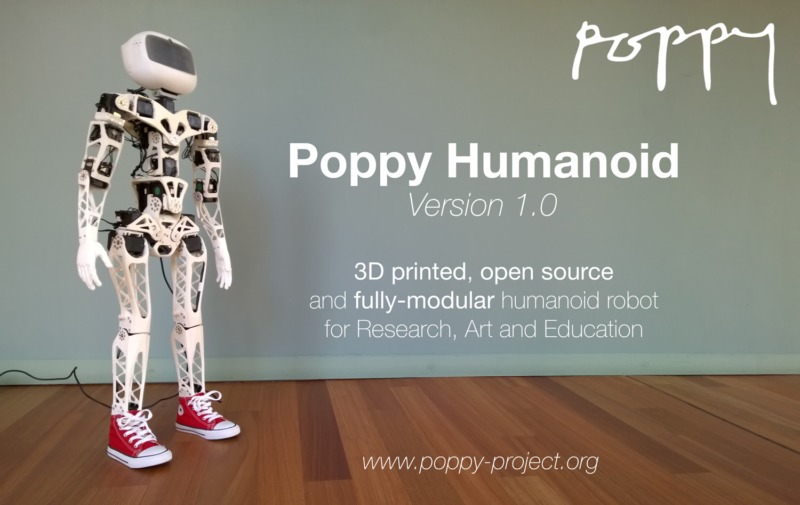

Poppy Humanoid
===================
[](https://pypi.python.org/pypi/poppy-humanoid/)

Poppy Humanoid is an open-source and 3D printed humanoid robot. Optimized for research and education purposes, its modularity allows for a wide range of applications and experimentations.



The first and most advanced creature is the fully 3D printed Poppy Humanoid.


## Build your own Poppy Humanoid

Building a complete Poppy Humanoid costs $8000-9000 with about 60% for buying the 25 Robotis Dynamixel actuators required. The full BOM is available here >> [Bill Of Material](hardware/doc/BOM.md).

**The STL files are available in [the releases](https://github.com/poppy-project/poppy-humanoid/releases) of this repository.**

Then the process to assemble a complete Poppy Humanoid takes about 7h for  handyman people. Yet the skills required are very limited and should not be a problem for anyone able to hold a screwdriver.

[](hardware/doc/Poppy_Humanoid_assembly_instructions.md)

The assembly process is fully documented with video tutorials.
### [Go to the Poppy Humanoid assembly documentation >>](hardware/doc/Poppy_Humanoid_assembly_instructions.md)

### Install poppy-humanoid
#### Install a Poppy board
Poppy Humanoid is made to work with an Odroid U3 or an Odroid XU4. We provide our own [system image](https://github.com/poppy-project/poppy-humanoid/releases) (based on Ubuntu 14.04) that can be directly copied to the SD-card or MMC. You can refer to the [documentation](http://docs.poppy-project.org/en/installation/burn-an-image-file.html) for more details. Note that if you buy it as a kit from one of the reseller you will also get a pre-installed SD-card.


You can also use our setup script directly on a Odroid based on Ubuntu or Debian. **Be aware tough that it takes some time and some good knowledge of Linux** This script is used to setup the Odroid to match our needs (custom Python, setup the web interface, a Poppy user...).
```
wget https://raw.githubusercontent.com/poppy-project/odroid-poppysetup/master/poppy_setup.sh -O poppy_setup.sh
sudo bash poppy_setup.sh poppy-humanoid
```
**For more informations, refer to the [poppy documentation](http://docs.poppy-project.org/en/installation/install-a-poppy-board.html)**.


#### Install on your personnal computer
If you want to install the software locally and not use the embedded board to control the robot or if you are working with the simulator, you will have to install Python. We strongly recommand using a pre-packaged distribution as [Anaconda](http://continuum.io/downloads) and install the [poppy-humanoid](https://github.com/poppy-project/poppy-humanoid/tree/master/software) package (the easiest way is with `pip install poppy-humanoid`). 

**For more informations, refer to the [poppy documentation](http://docs.poppy-project.org/en/installation/index.html)**.


## Support
You need support ?
The [Poppy forum](https://forum.poppy-project.org) is the best (and single) place to ask for help !

You can in particular check for the [Poppy Humanoid category](https://forum.poppy-project.org/c/poppy-creatures/humanoid).

## Contribution

If you are interrested by contribuing to the Poppy project, you can **take a look at [open issues](https://github.com/poppy-project/poppy-humanoid/issues) and [call for contributions](https://forum.poppy-project.org/tags/call-for-contributions)**.

Morevover, the Poppy project involves a very large scope of disciplines: 
 - Engineering fields such as computer science, mechanics, electronics, machine learning... 
 - Humanities such as cognitive science, psychology...
 - Life science such as biology, biomechanics,...
 - Community management, scientific mediation, communication...
 - Design such as web design, object design, UX,... 
 - Art with the need of animator to create [the illusion of life](http://en.wikipedia.org/wiki/Disney_Animation:_The_Illusion_of_Life) and emotions.

So there are many ways to contribute to this project and you are very welcome to do it.

Maybe the first step is to become a member of the community on the [poppy forum](https://forum.poppy-project.org).  The forum is the very central place to exchange with users and contributors. You can freely come and talk about your project or ideas with your prefered language.

For github ninja, you can of course fork this repository and open pull requests to propose your changes, or create issues to notify a problem.

## License

All the technological development work made in the Poppy project is freely available under open source licenses. Only the name usage *"Poppy"* is restricted and protected as an international trademark, please contact us if you want to use it or have more information.


|   License     |     Hardware    |   Software      |
| ------------- | :-------------: | :-------------: |
| Title  | [Creatives Commons BY-SA](http://creativecommons.org/licenses/by-sa/4.0/)  |[GPL v3](http://www.gnu.org/licenses/gpl.html)  |
| Logo  | [ ](http://creativecommons.org/licenses/by-sa/4.0/)  |[](http://www.gnu.org/licenses/gpl.html)  |


**Please keep references to the [Poppy project (www.poppy-project.org)](https://www.poppy-project.org/) and [authors](doc/authors.md) when you use or fork this work.**


## The Poppy project history

The Poppy project is born in 2012 in the [Flowers laboratory](https://flowers.inria.fr/) at [Inria Bordeaux Sud-Ouest](http://www.inria.fr/en/centre/bordeaux).
It was initiated during [Matthieu Lapeyre](https://github.com/matthieu-lapeyre)'s PhD Thesis surpervised by [Pierre Yves Oudeyer](http://www.pyoudeyer.com/). At the beginning, the development team was composed by [Matthieu Lapeyre](https://github.com/matthieu-lapeyre) (mechanics & design), [Pierre Rouanet](https://github.com/pierre-rouanet) (software) and [Jonathan Grizou](http://jgrizou.com/) (electronics).

This project is initially a fundamental research project financed by [ERC Grant Explorer](http://erc.europa.eu/) to explore the role of embodiement and morphology properties on cognition and especially on the learning of sensori-motor tasks.


### More on the project

- [Website](https://www.poppy-project.org)
- [Forum](https://forum.poppy-project.org)
- [Twitter](https://twitter.com/poppy_project)
- [Flickr](https://www.flickr.com/photos/poppy-project)
- [YouTube](https://www.youtube.com/channel/UC3iVGSr-vMgnFlIfPBH2p7Q)
- [Vimeo](https://vimeo.com/poppyproject/videos)
- [Thingiverse](http://www.thingiverse.com/poppy_project/)
