---
author:
- 'Manon Cortial, Génération Robots'
title: Poppy Humanoid Robot Assembly Guide
---

 

# Introduction

## The Poppy project

Poppy is an open hardware and open-source robotics project. It has been
designed to allow researchers and students to easily remove and replace
some parts of the body.

For example, different leg shapes have been tested on the Poppy Humanoid
robot to make the robot walk.

The Poppy humanoid robot is built using mainly MX-28 Dynamixel
servomotors, which are pretty powerful and may be harmful to your
fingers or materials.

So be very careful and put the robot in a free space while testing your
programs.

## About this documentation

This documentation contains some help and tips to build a Poppy Humanoid
robot. It does not replace the videos made by Inria, but complete and
sometimes corrects or updates them.

It contains a bit of context about Dynamixel servomotors and how to
assemble them (section \[dynamixel-hardware\]) and also how to set the
right parameters for them (section \[addressing-poppys-motors\]).

You will also find pictures of all the parts to help you name them
(section \[structural-parts\]), then assembly tips and links to the
assembly videos (section \[assembly-tips\]). As there is no video for
the head assembly, this doc contains a pretty complete guide for head
assembly (section \[head-assembly\]).

At the end, you will find a list of useful links (section
\[documentation-links\]) to help you find more information and help.

Please don’t hesitate to comment and correct this documentation on the
Poppy forum !

# Dynamixel hardware

The Poppy Humanoid robot is mainly built with [MX-28AT Dynamixel
servomotors](http://www.generationrobots.com/en/401858-servomotor-dynamixel-mx-28at.html)
(MX-28T are the previous version and can be used without any problem).
The other servomotors are MX-64T (bigger and stronger) and AX-12A
(smaller, used for the head).

Each Dynamixel servomotor embeds an electronic board allowing it to
receive different kind of orders (about goal, torque...) and communicate
with other Dynamixel servos. Therefore, you can chain up several
Dynamixel servomotors (each with a different ID) and command them all
from one end of the chain: each servomotor will pass the orders to the
next one.

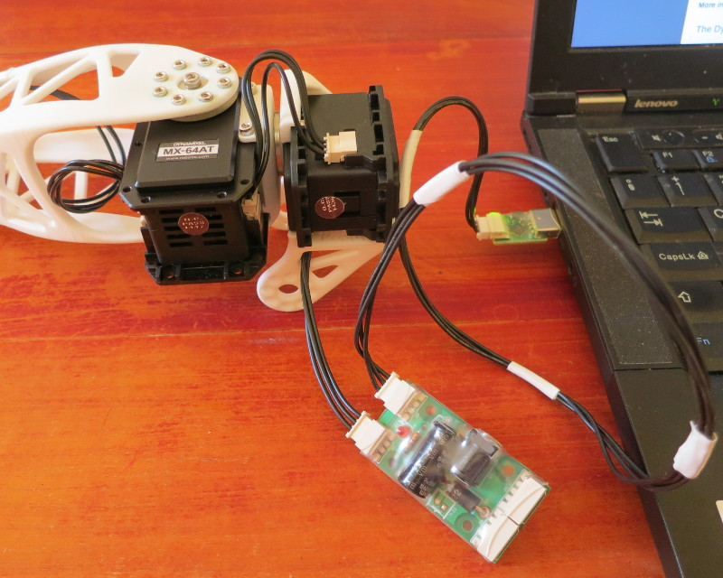

## Putting the Dynamixel horns to zero {#dynamixel-zero}

When you receive your Dynamixel servomotors, the horns are not mounted.
They are included in the packaging if the servo is packaged alone or
packaged separately for 6-pieces bulks (see next section to know what
horn goes to what servo).

When putting the controlled horn, be very careful to **put the dot on
the horn at the same point than the dot on the servo axis**. Once the
horn is put, it is most of the time **impossible to remove** ! This will
ensure that the zero position of the servo matches with the zero
position of the structure around.

 

On the outside of the horn, you also have three dots indicating the
orientation. You should find the same three dots on structural parts, so
be sure to match them.

## Horns of MX-28 and MX-64

On each Dynamixel servomotor apart from the AX-12A, you will have to
mount a horn to the motor axis. Most of the time, you will also have to
mount a free horn on the opposite side to provide better fixation points
for the structure parts.

To mount the main horn, put the plastic ring (white or black) and drive
the horn on the axis. **Be careful of the zero when putting the main
horn!** Then put thread locker on the big screw and screw it in the
middle.

Main horn mounted on a MX-28

For the free horn, first clip the ball bearing and the cap on the side
without shaft shoulder. Then put the horn on servomotor (with shaft
shoulder on servo side). Put thread locker on the big screw and screw
it. The horn should turn freely.

 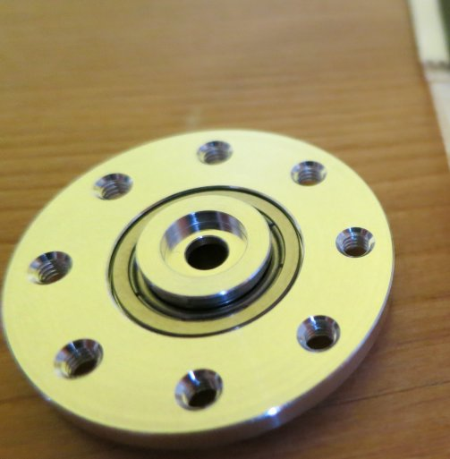 

Free horn mounted on a MX-64

Quick reminder of horn names and screw sizes:

| Servomotor | main horn | free horn | big horn screw | horn screws | case screws|
|------------| :-----------: | :-----------: | :----------------:| :-------------: | :-------------:|
|AX12-A |      none |       none      |    3x10mm |           2      |       2
|  MX28   |   HN07-N101 |  HN07-I101   |   2.5x8mm  |        2x3mm    |    2.5x6mm
|  MX64    |  HN05-N102  | HN05-I101  |     3x8mm  |        2.5x4mm   |    2.5x6mm |

You need an allen wrench of size 1.5mm for 2 screws, 2mm for 2.5 screws
and 2.5mm for 3 screws. The longer 2 screws need a Phillips screwdriver.

## Putting the nuts

To attach structural parts on the body of the servomotors, you have to
first insert the nuts in their sites. This step may be quite painful if
you don’t have elfic fingers (there are less nuts to insert in the AT
servomotors than in the T version used for the videos).

Here’s my tip: take the nut using thin tweezers and bring it in the site
with the right orientation. Put the end of the tweezers in the hole to
ensure good alignment. Then use flat pincers to adjust the nut.

  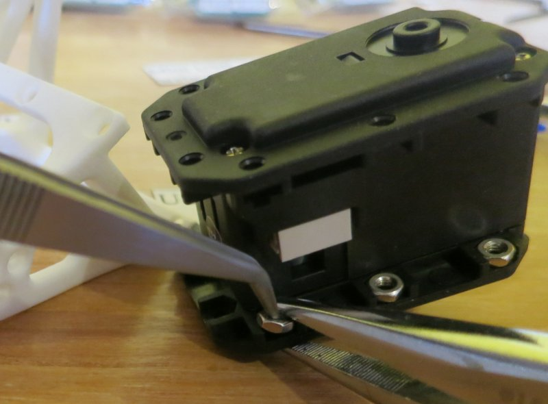

These nuts correspond to diameter 2.5mm screws, Allen wrench 2mm.

To build a full Poppy Humanoid robot, an electrical screwdriver is
strongly advised!

# Addressing Dynamixel motors {#addressing-poppys-motors}

By default, every Dynamixel servomotor has its ID set to 1. To use
several servomotors in a serial way, each of them must have a unique ID.

## Installing the driver for USB2AX

USB2AX is the device that will connect the Poppy Humanoid robot’s head
to the Dynamixel servomotors. It can also be used to control the
servomotors directly from your computer and that’s what we will do to
address the motors.

On Linux, no installation is needed, but you must add yourself in the
dialout group to have access to the USB port:

    sudo addgroup "username" dialout

Otherwise, the driver is available
[here](http://www.xevelabs.com/doku.php?id=product:usb2ax:quickstart).

Don’t forget to power up your motors (using a SMPS2Dynamixel) otherwise
they won’t be detected !

## Installing the scanning software

Use one of the two following software to access the Dynamixel
servomotors registers:

-   [Herborist](http://poppy-project.github.io/pypot/herborist.html):
    tool created by the Poppy Project team.

-   [Dynamixel
    Wizard](http://support.robotis.com/en/software/roboplus/dynamixel_monitor/quickstart/dynamixel_monitor_connection.htm):
    windows-only tool provided by Robotis.

Herborist comes with the Pypot library, but needs the additional library
PyQt4 for graphical interface.

    sudo pip install pypot
    sudo apt-get install python-qt4

It should then be directly accessible for a terminal:

    sudo herborist

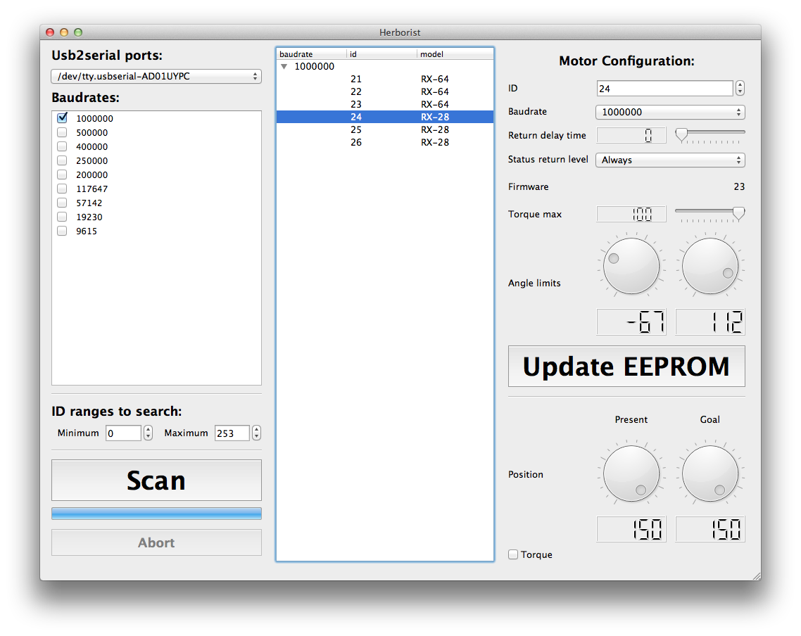

Connect each motor **one by one** to the USB2AX and use the ’scan’
button in Herborist or Dynamixel Wizard to detect it. If it’s a new
motor, it should have ID 1 and baudrate 57600bps, apart from AX-12A
servos who already have a 1000000 baudrate.

You have to set:

-   ID corresponding to the naming convention

-   Baudrate to 1 000 000 bps

-   Return delay time to 0 ms instead of 0.5 ms

In Herborist, don’t forget to click on the ’Update EEPROM’ button so the
changes are taken in account.

## Naming conventions

If you want your PoppyHumanoid object to correspond to your robot
without having to modify the configuration file, you should stick to the
Poppy Humanoid robot naming and addressing convention. This will ensure
that, in your code, when you use a motor’s name, you will really send
orders to the corresponding physical motor.

# Structural parts

\

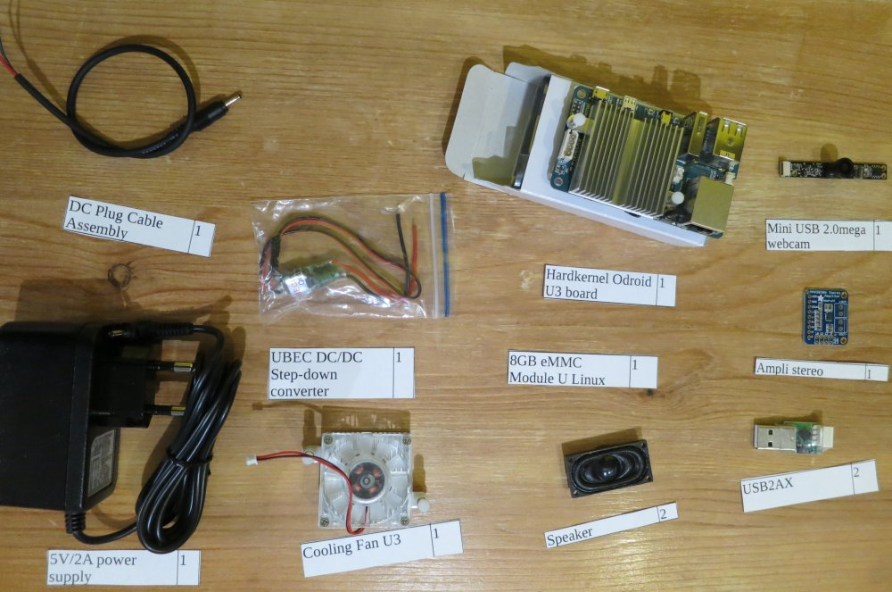\

\

\

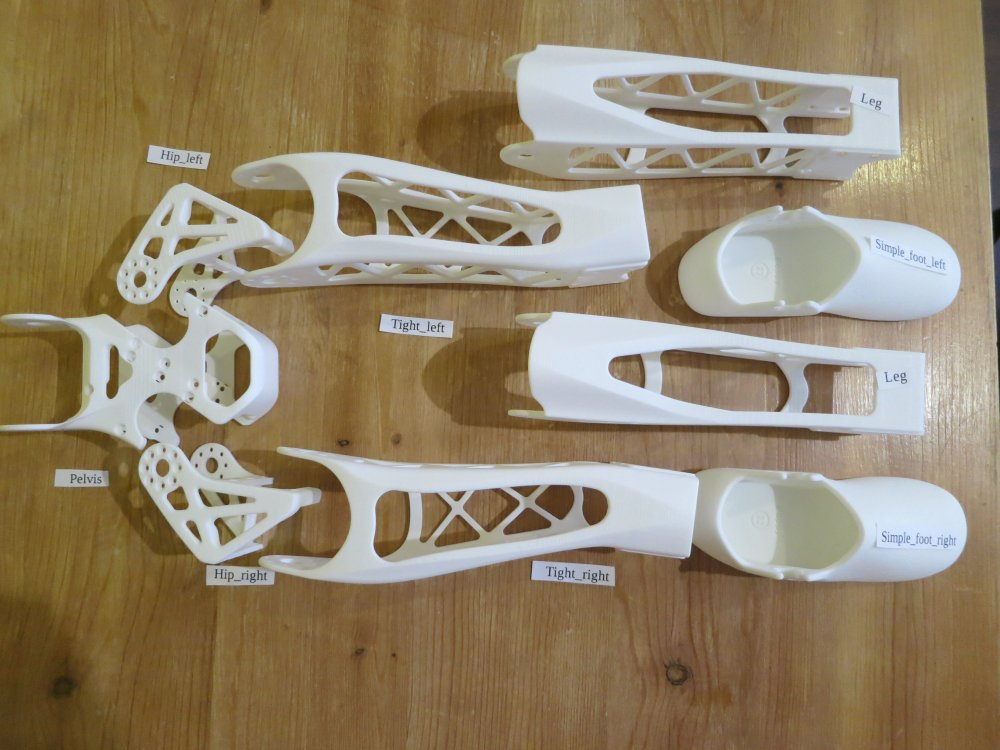

# Assembly tips

## Arms

-   **[Right](https://github.com/poppy-project/Poppy-basic-arms/blob/master/doc/subassemblies/right_forearm_assembly_instructions.md)/[Left](https://github.com/poppy-project/Poppy-basic-arms/blob/master/doc/subassemblies/left_forearm_assembly_instructions.md)
    forearm** The hand design slightly changed from the videos, but the
    nuts and screws remain the same.

    

-   **[Right](https://github.com/poppy-project/Poppy-basic-arms/blob/master/doc/subassemblies/right_upper_arm_assembly.md)/[Left](https://github.com/poppy-project/Poppy-basic-arms/blob/master/doc/subassemblies/left_upper_arm_assembly.md)
    upper arm** Plug a 200mm cable in the unused plug before screwing
    the arm\_z motors (ids 43 and 53), because it will be really hard to
    plug once the motor is inside the structure part.

-   **[Right](https://github.com/poppy-project/Poppy-basic-arms/blob/master/doc/subassemblies/right_upper_arm_shoulder_assembly.md)/[Left](https://github.com/poppy-project/Poppy-basic-arms/blob/master/doc/subassemblies/left_upper_arm_shoulder_assembly.md)
    upper arm/shoulder**

-   **[Right](https://github.com/poppy-project/Poppy-basic-arms/blob/master/doc/right_arm_assembly_instructions.md)/[Left](https://github.com/poppy-project/Poppy-basic-arms/blob/master/doc/left_arm_assembly_instructions.md)
    arm assembly**

-   **[Trunk and arms
    assembly](https://github.com/poppy-project/poppy-humanoid/blob/master/hardware/doc/Poppy_Humanoid_assembly_instructions.md)**
    To distinguish between left and right shoulder parts, look at the
    three dots: the single dot should be down when the shoulder is in
    “zero” position (along the shoulder\_y motor).

Motors lists:

| Sub-assembly name       	|  Motor name  	|   Type  	| ID 	|
|-------------------------	|:------------:	|:-------:	|:--:	|
| Left upper arm/shoulder 	| l\_shoulder\_x 	| MX-28AT 	| 42 	|
| Left upper arm          	|   l\_arm\_z  	| MX-28AT 	| 43 	|
| Left upper arm          	|  l\_elbow\_y 	| MX-28AT 	| 44 	|

| Sub-assembly name        |   Motor name   |   Type  | ID |
|--------------------------|:--------------:|:-------:|:--:|
| Right upper arm/shoulder | r\_shoulder\_x | MX-28AT | 52 |
| Right upper arm          |    r\_arm\_z   | MX-28AT | 53 |
| Right upper arm          |   r\_elbow\_y  | MX-28AT | 54 |

## Trunk

-   **[Double
    MX64](https://github.com/poppy-project/Robotis-library/blob/master/doc/en/double_MX64_assembly.md)**

-   **[Double
    MX28](https://github.com/poppy-project/Robotis-library/blob/master/doc/en/double_MX28_assembly.md)**
    Don’t screw the i101-Set\_to\_ MX28\_link (the plastic part with a
    free horn on it) too tightly, or don’t screw it at all since you
    will need to unscrew it during the trunk assembly.

-   **[Spine](https://github.com/poppy-project/Poppy-multiarticulated-torso/blob/master/doc/en/subassembly/spine_assembly_instructions.md)**

-   **[Chest](https://github.com/poppy-project/Poppy-multiarticulated-torso/blob/master/doc/en/subassembly/chest_assembly_instructions.md)**
    The video shows a HN07\_I101 in the prepared parts, but you don’t
    need it.

-   **[Trunk
    assembly](https://github.com/poppy-project/Poppy-multiarticulated-torso/blob/master/doc/en/5_DoFs_humanoid_spine.md)**
    You have to insert the nuts in the chest before mounting the double
    MX-28 part. You also have to put nuts in the abdomen before mounting
    the double MX-64 part.

    The abdomen part you have has a “Poppy” mark on the back, while the
    one on the video don’t. You also have holes to screw the
    SMPS2Dynamiel, instead of sticking it (use 2.5\*8mm screws).

    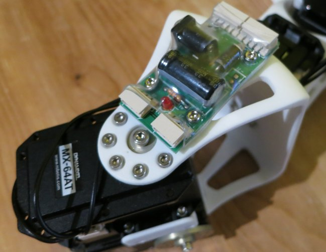

Motors list:

| Sub-assembly name |   Motor name   |   Type  | ID |
|-------------------|:--------------:|:-------:|:--:|
| Double MX64       |     abs\_y     | MX-64AT | 31 |
| Double MX64       |     abs\_x     | MX-64AT | 32 |
| Spine             |     abs\_z     | MX-28AT | 33 |
| Double MX28       |     bust\_y    | MX-28AT | 34 |
| Double MX28       |     bust\_x    | MX-28AT | 35 |
| Chest             |     head\_z    |  AX-12A | 36 |
| Chest             | l\_shoulder\_y | MX-28AT | 41 |
| Chest             | r\_shoulder\_y | MX-28AT | 51 |

## Legs

There is only a video for left leg assembly. While assembling the right
leg, be sure to put your motors symmetrical compared to the left leg.
Also don’t forget to change the motors IDs from 12-15 to 22-25.

-   **[Hip](https://github.com/poppy-project/Poppy-lightweight-biped-legs/blob/master/doc/subassemblies/left_hip_assembly_instructions.md)**

-   **[Tight](https://github.com/poppy-project/Poppy-lightweight-biped-legs/blob/master/doc/subassemblies/left_thigh_assembly_instructions.md)**

-   **[Shin](https://github.com/poppy-project/Poppy-lightweight-biped-legs/blob/master/doc/subassemblies/left_shin_assembly_instructions.md)**
    If you received your Poppy kit from Generation Robots, you can use
    the custom 220mm cables instead of really short 200mm cables.

-   **[Right](https://github.com/poppy-project/Poppy-lightweight-biped-legs/blob/master/doc/subassemblies/right_leg_assembly_instructions.md)/[Left](https://github.com/poppy-project/Poppy-lightweight-biped-legs/blob/master/doc/subassemblies/left_leg_assembly_instructions.md)
    leg assembly**

-   **[Pelvis](https://github.com/poppy-project/Poppy-lightweight-biped-legs/blob/master/doc/subassemblies/pelvis_assembly_instructions.md)**
    The videos shows 2x5mm screws. Use the 2x6mm screws that you can
    find in the Bolt-nut set BNS-10.

-   **[Torso and legs
    assembly](https://github.com/poppy-project/poppy-humanoid/blob/master/hardware/doc/Poppy_Humanoid_assembly_instructions.md)**

Motors lists:

| Sub-assembly name |  Motor name |   Type  | ID |
|-------------------|:-----------:|:-------:|:--:|
| Pelvis            |  l\_hip\_x  | MX-28AT | 11 |
| Left hip          |  l\_hip\_z  | MX-28AT | 12 |
| Left hip          |  l\_hip\_y  | MX-64AT | 13 |
| Left thigh        |  l\_knee\_y | MX-28AT | 14 |
| Left shin         | l\_ankle\_y | MX-28AT | 15 |

| Sub-assembly name |  Motor name |   Type  | ID |
|-------------------|:-----------:|:-------:|:--:|
| Pelvis            |  r\_hip\_x  | MX-28AT | 21 |
| Right hip         |  r\_hip\_z  | MX-28AT | 22 |
| Right hip         |  r\_hip\_y  | MX-64AT | 23 |
| Right thigh       |  r\_knee\_y | MX-28AT | 24 |
| Right shin        | r\_ankle\_y | MX-28AT | 25 |

## Head {#head-assembly}

| Sub-assembly name |  Motor name |   Type  | ID |
|-------------------|:-----------:|:-------:|:--:|
| Head              |   head\_y   | AX-12A  | 37 |

### Setup of the Odroid board

The Odroid is normally shipped with a eMMC module with Ubuntu 1.14
already flashed (it should have a red sticker on it). Simply plug it on
the Odroid board and power it. After boot time, it should have the red
light steady and the blue light flashing.

If you don’t have a pre-flashed eMMC module, follow these instructions:
<https://github.com/poppy-project/poppy_install>

Connect the Odroid board to your network using an ethernet cable. You
have to access a wired network for initial setup (I tried link-local
without success).

Windows users may wish to install the
[Bonjour](https://support.apple.com/kb/DL999?locale=fr_FR&viewlocale=fr_FR)
software (the link is for the printer version, which does very well what
we want it to do). Bonjour is installed by default on Linux and Mac. It
is used to communicate with another device using its name instead of its
IP.

You should get an answer if you type:

    ping odroid.local

Windows users now probably wish to install
[Putty](http://www.putty.org/) or any SSH client. Linux and Mac users
have one installed by default. Then:

    ssh odroid@odroid.local

Password is odroid. Congratulations, you are now inside the Odroid!

Make sure the Odroid board has access to the internet and enter:

    curl -L https://raw.githubusercontent.com/poppy-project/
    poppy_install/master/poppy_setup.sh | sudo bash

Enter the odroid password. This command will download and run a script
which will download and prepare installation. The board asks for a
reboot:

    sudo reboot

You loose the SSH connection. The board has changed hostname and
password, so wait for the blue light to flash regularly and connect
with:

    ssh poppy@poppy.local

As you guessed, password is poppy. Installation process takes place
automatically (and takes a while). When you see ’System install
complete’, do a Ctrl+C to finish. After a new reboot, your Odroid board
is ready.

### Neck assembly

The last servomotor is head\_y, a AX-12A. Set its ID to 37 and response
time to 0 (baudrate is already at 1000000).

Screw the neck to head\_z servo (2x8mm screws). There are marks on the
neck and on the servo to help you determine the orientation.

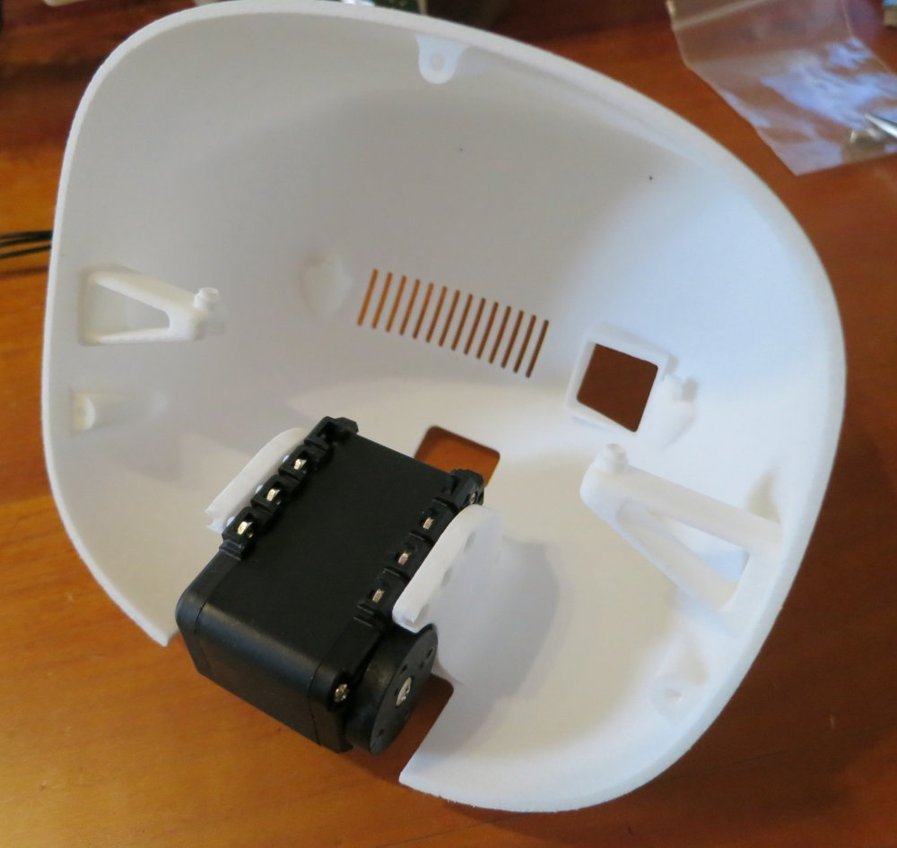

Put 2 nuts in the servo case and attach it in the head\_back part.

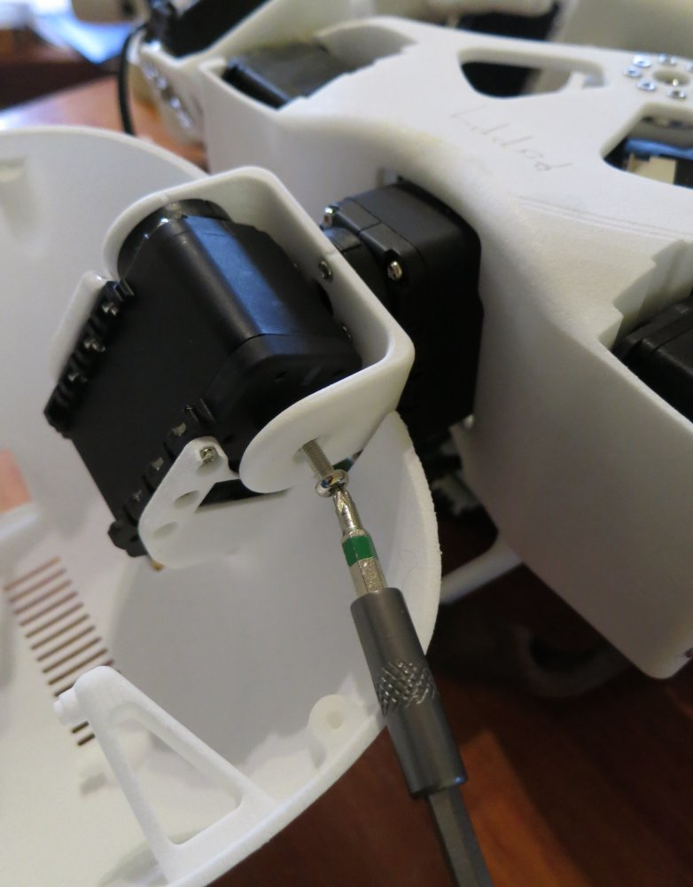\

Assemble the servo on the neck (2 screws on the controlled side, the big
screw on the other side). You again have marks on the neck and on the
servo for orientation.

Connect head\_y to the dispatcher by passing the cable through the hole
in the head.

Plug a 500mm cable from the pelvis SMPS2Dynamixel board to the back of
the head. Attach a USB2AX at the end of this cable in the head.

Use a 140mm cable to connect the head\_y motor to another USB2AX.

### Camera and screen

Attach the camera support to head\_front using M2.5x4mm screws. Put tape
on the screws to avoid electrical interferences with the camera board.

Attach the camera to its support using 3 2x6mm screws.

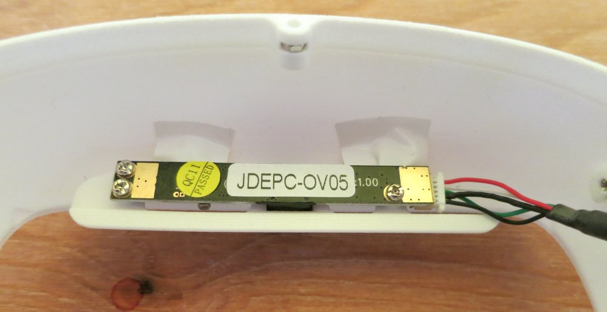

Put the screen and screen cover in the head. Attach the manga screen (or
the fake one) with 2 2.5x6mm screws.

 

### Electronics

If you don’t have pre-soldered components, see:
<https://github.com/poppy-project/Poppy-minimal-head-design/blob/master/doc/poppy_soldering.md>

Pass the Dynamixel connector of the Ubec through the hole in the head
and connect it to the torso SMPS2Dynamixel.

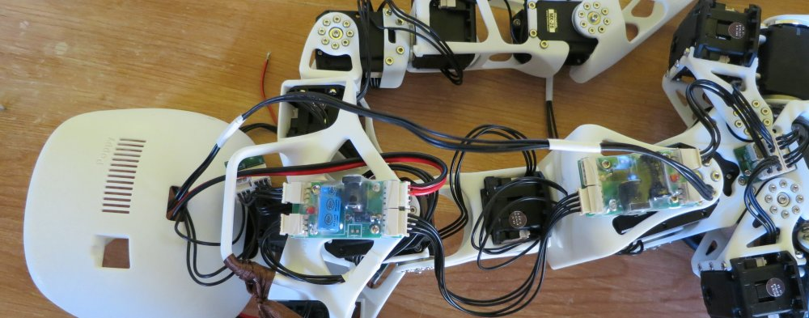

Attach both the other side of Ubec and the Odroid power cable to the
audio amplifier. Be sure no to allow any short-circuit.

Plug the audio jack. Wires order from left to right (when power terminal
is farthest right): red-black-uncolored-white

Put 2 nuts around the flowers openings then attach the speakers using 2
x3mm screws.

Connect the speakers to audio ampli, left speaker black wire on Lout,
Right ampli black wire on Rout.

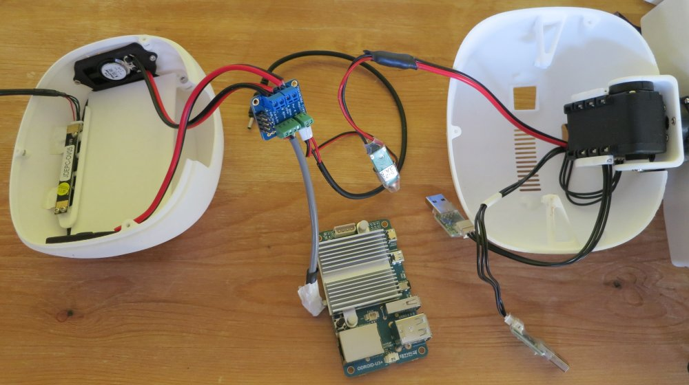

Plug audio jack in Odroid, then use 2 2.5x8mm screws to attach the
Odroid board. Make sure the Ethernet connector is correctly placed in
front of the corresponding hole.

Plug the power jack. On the hub, plug the camera and the two USB2AXs.
Plug the wifi dongle and the Razor board if you have them. Push the hub
above the Odroid.

Then close the head using 3 2x8mm screws.

# Useful links {#documentation-links}

## Assembly instructions

[https://github.com/poppy-project/poppy-humanoid/blob/master/
hardware/doc/Poppy\_Humanoid\_assembly\_instructions.md](https://github.com/poppy-project/poppy-humanoid/blob/master/hardware/doc/Poppy_Humanoid_assembly_instructions.md)

Bill of Material:

<https://github.com/poppy-project/Poppy-lightweight-biped-legs/blob/master/doc/BOM.md>

## Forum and docs

Poppy project website: <https://www.poppy-project.org/>

Poppy project forum: <https://forum.poppy-project.org/>

herborist doc.: <http://poppy-project.github.io/pypot/herborist.html>

Dynamixel wizard doc.:

[http://support.robotis.com/en/software/roboplus/
dynamixel\_monitor/quickstart/dynamixel\_monitor\_connection.htm](http://support.robotis.com/en/software/roboplus/dynamixel_monitor/quickstart/dynamixel_monitor_connection.htm)

Bonjour software:

<https://support.apple.com/kb/DL999?locale=fr_FR&viewlocale=fr_FR>

STL files:

[https://github.com/poppy-project/poppy-humanoid/releases/download/
Official\_1.0\_Hardware\_release/STL\_3D\_printed\_parts.zip](https://github.com/poppy-project/poppy-humanoid/releases/download/Official_1.0_Hardware_release/STL_3D_printed_parts.zip)

## How to improve this guide?

You found an imprecision or an error in this guide? We need to correct
it!

If you master LaTeX and Github, get the tex file at
<https://github.com/HumaRobotics/poppy-examples/tree/master/doc> and do
a pull request.

Otherwise, go to the forum and point the problem in this topic:
<https://forum.poppy-project.org/t/quickstart-assembly-and-programming-plus-some-code-examples/1228>

Thanks in advance!
