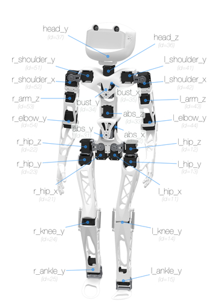

# Addressing Dynamixel motors

By default, every Dynamixel servomotor has its ID set to 1. To use
several servomotors in a serial way, each of them must have a unique ID.

## Installing the driver for USB2AX

USB2AX is the device that will connect the Poppy Humanoid robot’s head
to the Dynamixel servomotors. It can also be used to control the
servomotors directly from your computer and that’s what we will do to
address the motors.

On Linux, no installation is needed, but you must add yourself in the
dialout group to have access to the USB port:

    sudo addgroup "username" dialout

Otherwise, the driver is available
[here](http://www.xevelabs.com/doku.php?id=product:usb2ax:quickstart).

Don’t forget to power up your motors (using a SMPS2Dynamixel) otherwise
they won’t be detected !

## Installing the scanning software

Use one of the two following software to access the Dynamixel
servomotors registers:

-   [Herborist](http://poppy-project.github.io/pypot/herborist.html):
    tool created by the Poppy Project team.

-   [Dynamixel
    Wizard](http://support.robotis.com/en/software/roboplus/dynamixel_monitor/quickstart/dynamixel_monitor_connection.htm):
    windows-only tool provided by Robotis.

Herborist comes with the Pypot library, but needs the additional library
PyQt4 for graphical interface (sudo may not be needed).

    sudo apt-get install python-qt4 python-numpy python-scipy python-pip
    sudo pip install pypot
    

It should then be directly accessible in a terminal:

    sudo herborist

Connect each motor **one by one** to the USB2AX and use the ’scan’
button in Herborist or Dynamixel Wizard to detect it. If it’s a new
motor, it should have ID 1 and baudrate 57600bps, apart from AX-12A
servos who already have a 1000000 baudrate.

You have to set:

-   ID corresponding to the naming convention

-   Baudrate to 1 000 000 bps

-   Return delay time to 0 ms instead of 0.5 ms

In Herborist, don’t forget to click on the ’Update EEPROM’ button so the
changes are taken in account.

## Naming conventions

If you want your PoppyHumanoid object to correspond to your robot
without having to modify the configuration file, you should stick to the
Poppy Humanoid robot naming and addressing convention. This will ensure
that, in your code, when you use a motor’s name, you will really send
orders to the corresponding physical motor.

[**<< Back to menu**](assemblyGuide.md)
[**<< Dynamixel hardware**](dynamixel_hardware.md)
