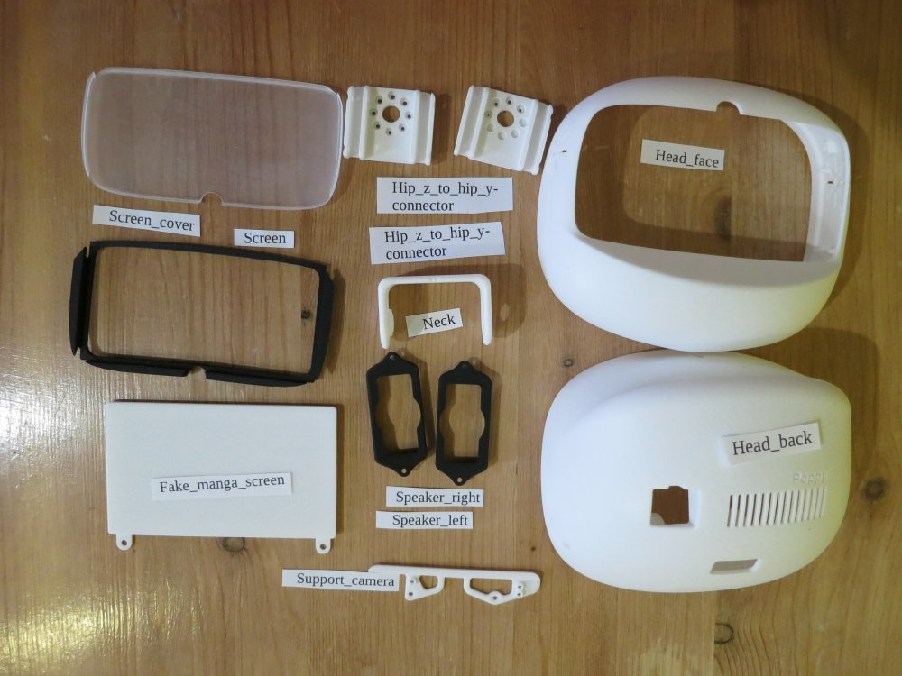
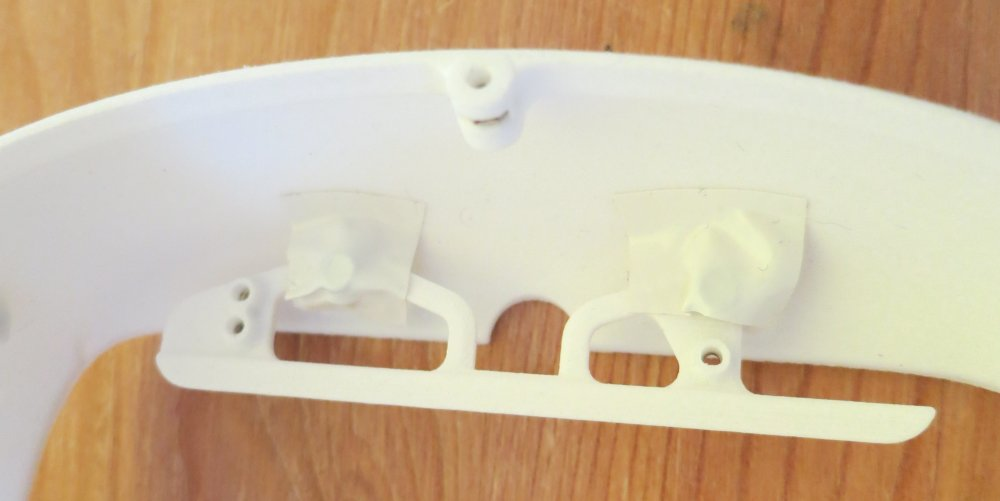
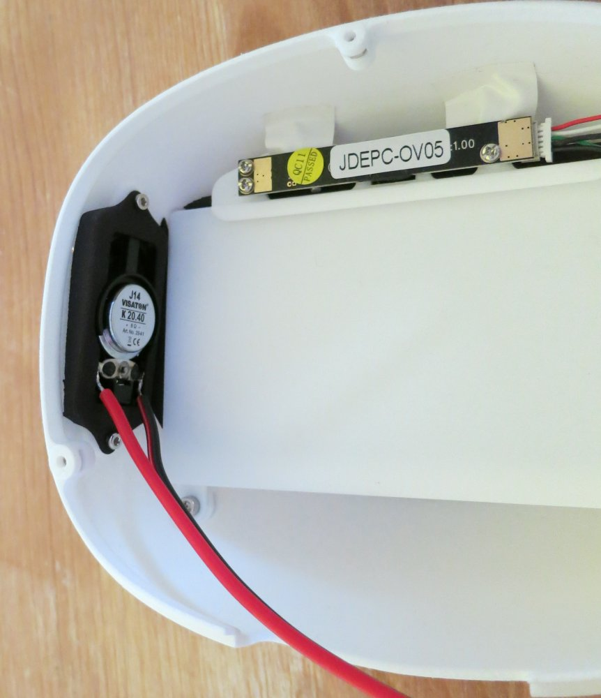

## Assemblage de la tête {#head-assembly}

\

\

| Nom du sous-assemblage   | Nom anglais    	|  Nom du moteur|   Type  	| ID 	|
|-------------------|:-----------:|:-------:|:--:|
| Tête              | Head              |   head\_y   | AX-12A  | 37 |

### Préparation de la carte Odroid

Normalement, vous recevez la carte Odroid avec un module eMMC avec Ubuntu 14.04 déjà installé (il doit y avoir un sticker rouge sur la carte). Vous n'avez plus qu'à la brancher sur la carte Odroid et à l'alimenter. Une fois démarrée, vous devriez voir une led rouge fixe et une led bleu clignotante.

Si vous n'avez pas de module eMMc pré-flashé, voyez ces instructions: <https://github.com/poppy-project/poppy_install>

Connectez la carte Odroid à votre réseau en utilisant un câble ethernet. La connection par câble est nécessaire pour la préparation initiale (j'ai tenté la connection local-link, mais sans succès).

Les utilisateurs de Windows voudrons probablement installer le logiciel [Bonjour](https://support.apple.com/kb/DL999?locale=fr_FR&viewlocale=fr_FR) (le lien est pour la version imprimante, qui marche très bien pour notre usage). Bonjour est installé par défaut sur Linux et Mac. Il est utilisé pour communiquer avec d'autres appareils en utilisant leur nom au lieu de leur adresse IP.

Vous devriez recevoir une réponse à la commande:

    ping odroid.local

Les utilisateurs de Windows doivent maintenant installer [Putty](http://www.putty.org/) ou un autre client SSH. Les utilisateurs de Mac et Linux en ont un installé par défaut.

Ensuite:

	ssh odroid@odroid.local

Le mot de passe est odroid. Bravo, vous êtes maintenant à l'intérieur de la carte Odroid !

Assurez vous que la carte ait accès à internet et entrez:

	curl -L https://raw.githubusercontent.com/poppy-project/poppy_install/master/poppy_setup.sh | sudo bash

Entrez le mot de passe de l'Odroid. Cette cammande va télécharger et lancer un script qui s'occupera de télécharger et de préparer l'installation. La carte demande à être redémarrée:

	sudo reboot

Vous perdez la connexion. Le hostname et le mot de passe de la carte ont changé. Attendez que la led bleue clignote régulièrement et connectez vous avec:

	ssh poppy@poppy.local

Vous l'avez deviné, le mot de passe est maintenant poppy. L'installation se fait automatiquement (et prend beaucoup de temps). Quand vous voyez 'System install complete', faites un Ctrl+C pour finir. Après un nouveau redémarrage, votre carte Odroid est prête.

### Assemblage du cou

Le dernier servomoteur est head\_y, un AX-12A. Changez son ID pour 37 et son temps de réponse pour 0 (son baudrate est déjà à 1000000).

 Vissez le cou au servo head\_z (vis de M2x8mm). Il y a des marques sur le servo pour vous aider à l'orienter correctement.

 Mettez des écrous \diameter 2 dans le boitier du servo et attachez le à l'arrièce de la tête (pièce  head\_back).

\

Assemblez le servo sur le cou (vis M2 du côté contrôlé, la grosse vis de l'autre côté). Il y a de nouveau des marques sur le cou et le servo pour l'orientation.

Connectez head\_y au module d'extension en passant la câble par le trou à l'arrière de la tête.

Branchez un câble de 50cm sur le SMPS2Dynamixel du pelvis et faites le passer dans la tête. Branchez un USB2AX à l'extrémité dans la tête.

Utilisez un câble de 140mm pour connecter le moteur head\_y à un autre USB2AX.

### Caméra et écran

Attachez le support de la caméra à head\_front avec des vis M2.5x4mm. Ajoutez du scotch pour éviter les interférence electriques avec la carte de la caméra.

Attachez la caméra à son support avec 3 vis M2x6mm.

Mettez les pièce screen et screen cover dans la tête. Attachez le manga screen (ou le faux) avec 2 vis M2.5x6mm.

 

### Composants électroniques

Si vous n'avez pas le composants pré-soudés, suivez d'abord ces instructions: <https://github.com/poppy-project/Poppy-minimal-head-design/blob/master/doc/poppy_soldering.md>

Faites passer le connecteur Dynamixel de l'Ubec par le trou de la tête et connectez le au SMPS2Dynamixel du torse.

Attachez l'autre côté de l'Ubec et le câble d'alimentation de l'Odroid à l'amplificateur audio. Assurez vous qu'il n'y a pas de court-circuit possible.

Connectez la prise audio : de la gauche vers la droite (quand le bornier d'alimentation est complètement à droite): rouge-noir-sans couleur-blanc.

Utilisez des écrous de M2 autour des ouvertures en forme de fleur et attachez les haut-parleurs avec des vis M2 x3mm.

Connectez les haut-parleurs à l'amplificateur audio, le haut parleur gauche a le fil noir sur Lout et le haut parleur droit a le fil noir sur Rout.

 Branchez la prise audio dans l'Odroid, puis utilisez 2 vis M2.5x8mm pour attacher la carte. Assurez vous que le connecteur ethernet est bien positionné devant le trou correspondant à l'arrière de la tête.

Branchez le câble d'alimentation. Sur le hub USB, branchez la caméra et les deux USB2AXs. Branchez également le dongle Wifi et la carte Razor si vous les avez. Poussez le hub au dessus de l'Odroid.

 Puis fermez la tête avec 3 vis M2x8mm.

