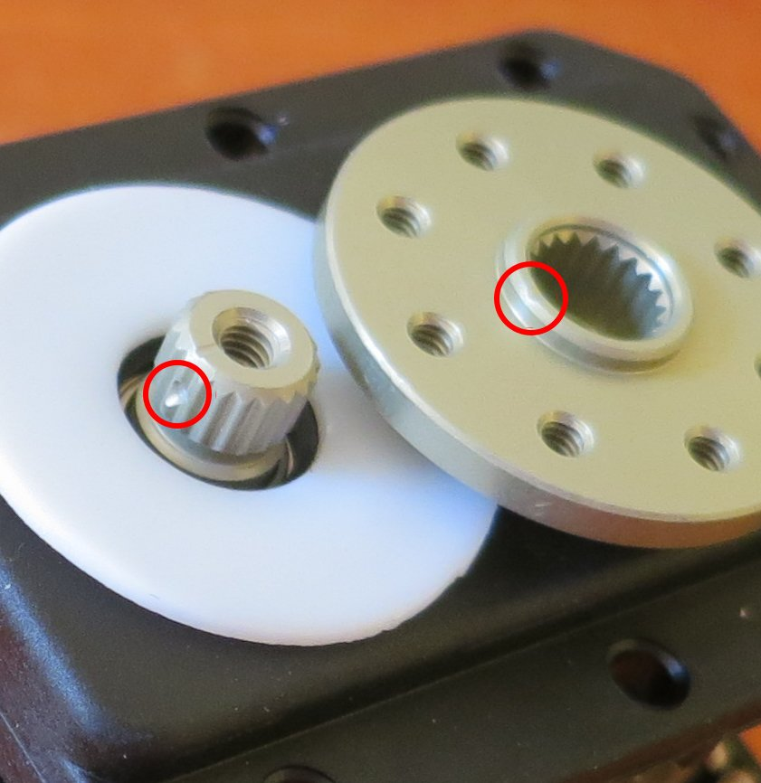
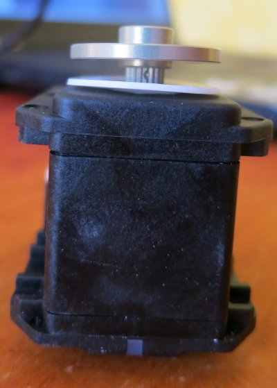
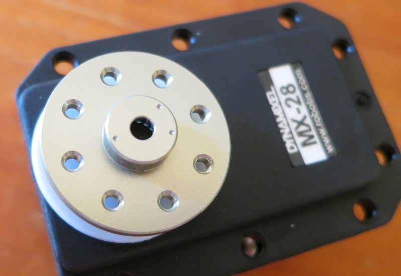
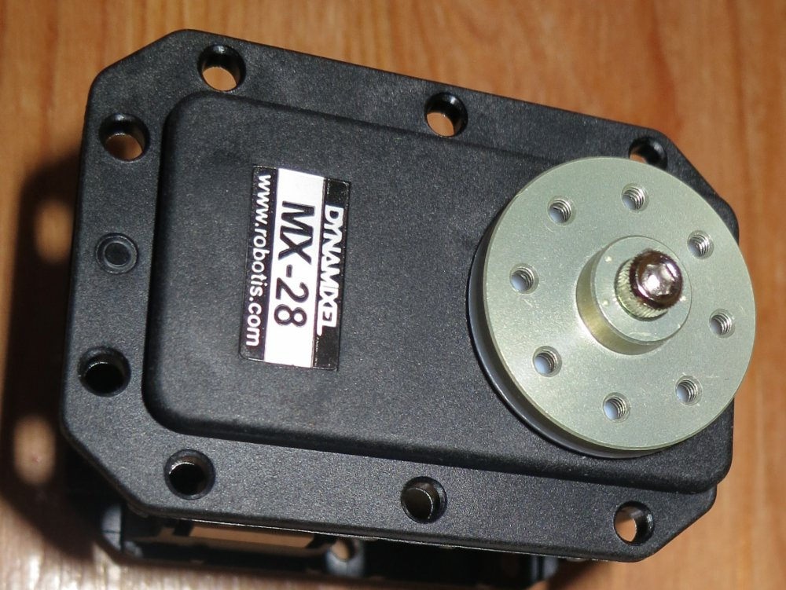
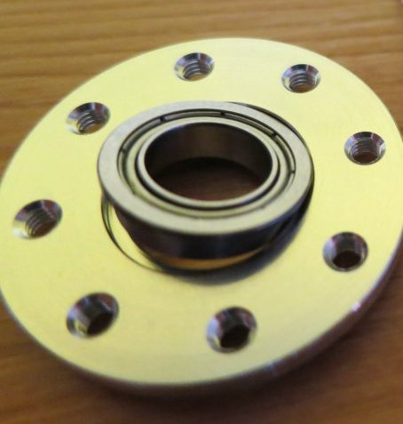
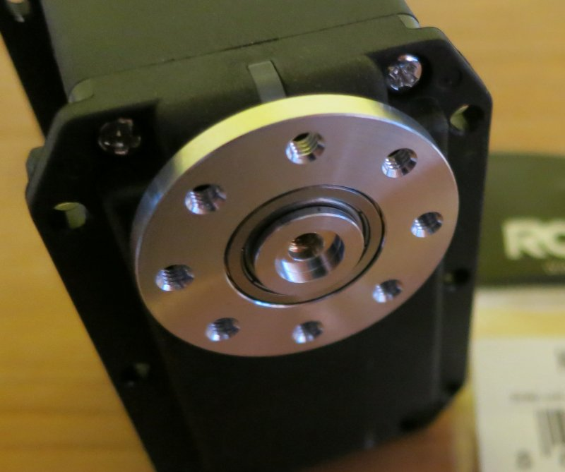
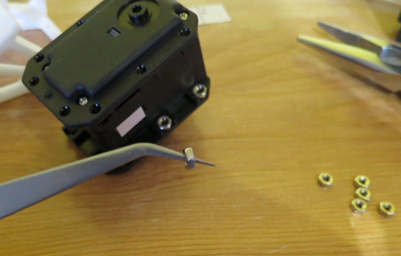
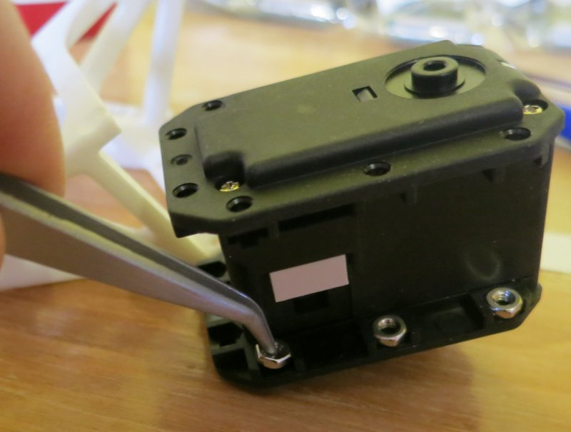

# Materiel Dynamixel

Le robot Poppy Humanoid est principalement actionné par des servomoteurs [Dynamixel MX-28AT](http://www.generationrobots.com/fr/401858-servomotor-dynamixel-mx-28at.html) (les MX-28T sont la version précédente et peuvent être utilisés sans aucun problème). Les autres servomoteurs sont des MX-64T (plus gros et plus puissants) et des AX-12A (plus petits, utilisés pour la tête).

Chaque servomoteur Dynamixel embarque une carte électronique qui lui permet de recevoir différents types d'ordres (en position, vitesse, couple maximal...) et de communiquer avec d'autres servomoteurs Dynamixel.C'est pourquoi vous pouvez brancher les servomoteurs en série (avec un ID différent pour chacun) et les commander tous depuis l'un des bouts de la chaîne: chaque servomoteur transmettra les ordres au suivant.

## Mettre le zéro des palonniers Dynamixel {#dynamixel-zero}

** Cette étape est cruciale pour éviter d'endommager vos servomoteurs de façon permanente !**

Quand vous recevez vos servomoteurs Dynamixel, les palonniers (les pièces mobiles qui se fixent dans l'axe du moteur) ne sont pas montés. Ils sont inclus dans les boites si le servomoteurs est en boite individuelle ou sont fournis à part si les servomoteurs sont en boites de 6 (la section suivante vous indique quel palonnier va avec quel servo).

En mettant le palonnier asservi, faites très attention à **aligner la marque sur le palonnier à celle sur le servo**. Une fois que le palonnier est mis, il est la plupart du temps **impossible à enlever** ! Ceci assure que la position zéro du servomoteur correspond à la position zéro de la structure mécanique.

 

Sur l'extérieur du palonnier, vous avez trois points indiquant l'orientation. Vous trouverez les mêmes trois points sur les pièces de structure, soyez attentif à les aligner correctement.

## Palonniers des MX-28 et MX-64

Sur chaque servomoteur Dynamixel à part les AX-12A, you aurez à monter le palonnier sur l'axe du moteur. Très souvent, vous devrez également monter un palonnier libre de l'autre côté pour assurer une meilleure fixation aux éléments de structure.

Pour assembler le palonnier principal, mettez d'abord la rondelle de plastique (blanche ou noire) puis enfoncez le palonnier sur l'axe. **Attention à la position du zéro en mettant le palonnier principal !** Mettez ensuite du frein filet sur la grosse vis et vissez là au centre.

Palonnier principal monté sur un MX-28.

Pour le palonnier libre, positionnez le roulement à billes et le capuchon du côté côté avec un renfoncement. Mettez le palonnier sur le servomoteur avec le capuchon vers l'extérieur. Mettz du frein filet sur la grosse vis et vissez là au centre. Le palonnier doit tourner librement.

  

Palonnier libre monté sur un MX-24

Références des noms de palonniers et des tailles de vis:

| Servomoteur | Palonnier | Palonnier | grosse vis   | petites vis  | vis du  |
|------------| :-----------: | :-----------: | :----------------:| :-------------: | :-------------:|
|             | principal | libre     | du palonnier | du palonnier | boitier | 
|AX12-A |      aucun |       aucun      |    M3x10mm |           M2      |       M2
|  MX28   |   HN07-N101 |  HN07-I101   |   M2.5x8mm  |       M2x3mm    |    M2.5x6mm
|  MX64    |  HN05-N102  | HN05-I101  |     M3x8mm  |        M2.5x4mm   |    M2.5x6mm |

Utilisez une clé Allen de taille 1.5mm pour les vis M2, 2mm pour les vis de M2.5, 2.5mm pour les vis M3. Les vis M2 plus longues sont cruciformes.

## Mettre les écrous

Pour attacher les pièces de structure sur le boitier des servomoteurs, il faut d'abord insérer les écrous dans leurs emplacements. Cette étape peut être assez longue et pénible si vous n'avez pas des doigts de fée (les vidéos montres des servomoteurs de modèles T, il y a moins d'écrous à mettre dans les modèles AT car certains trous sont directement filetés).

Voici une astuce: Manipulez l'écrou en utilisant une brucelle. Approchez le de son emplacement avec la bonne orientation et mettez le bout de la brucelle dans le trou pour assurer l'alignement. Utilisez ensuite une pince plate pour insérer l'écrou.

  

Ces écrous correspondent à des vis de diamètre 2.5.

Pour construire un Poppy Humanoid entier, un tournevis electrique est fortement conseillé ! 

