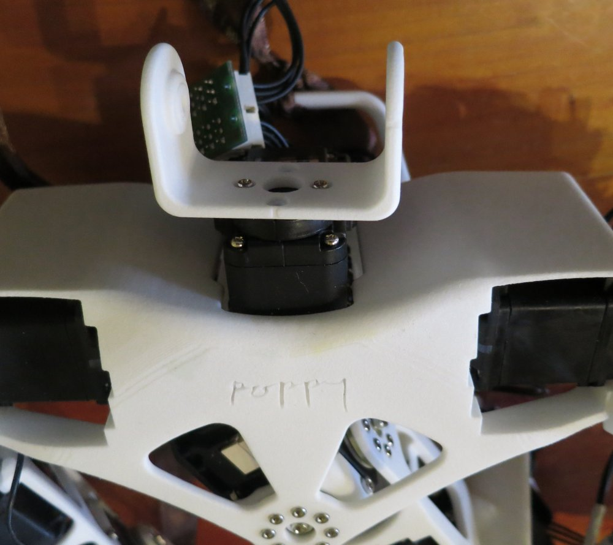
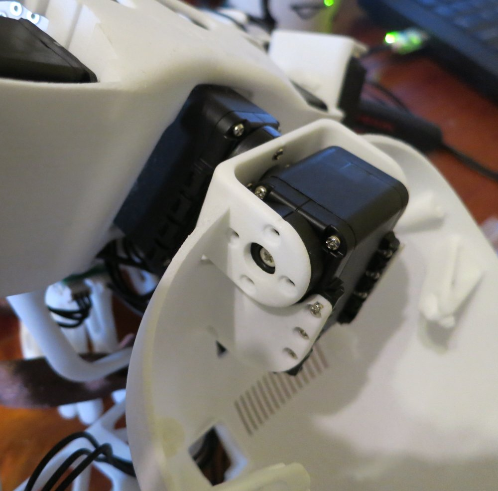
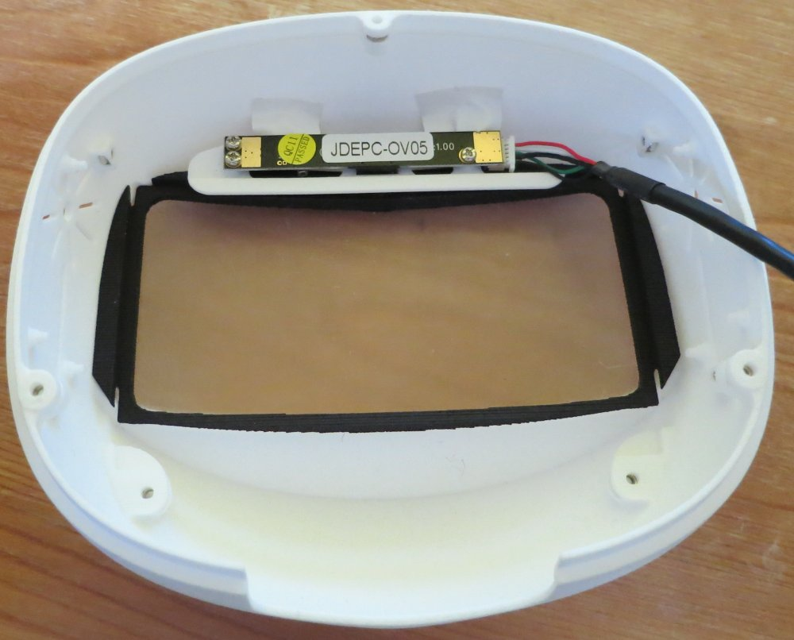
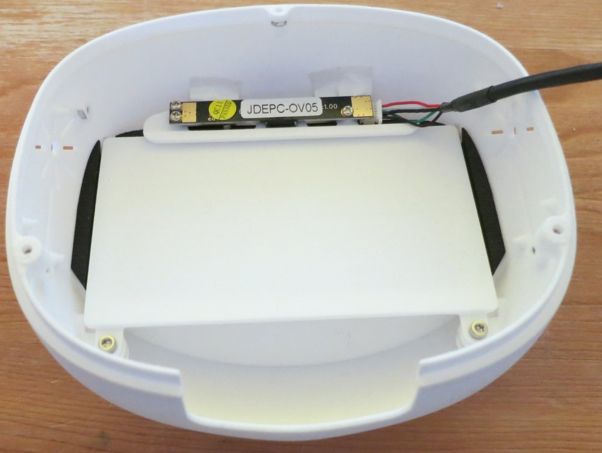
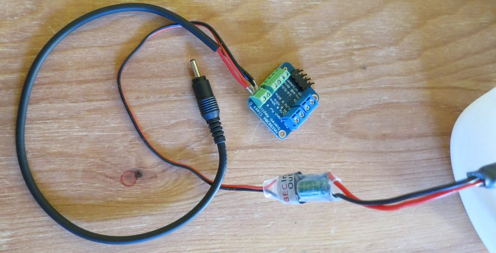
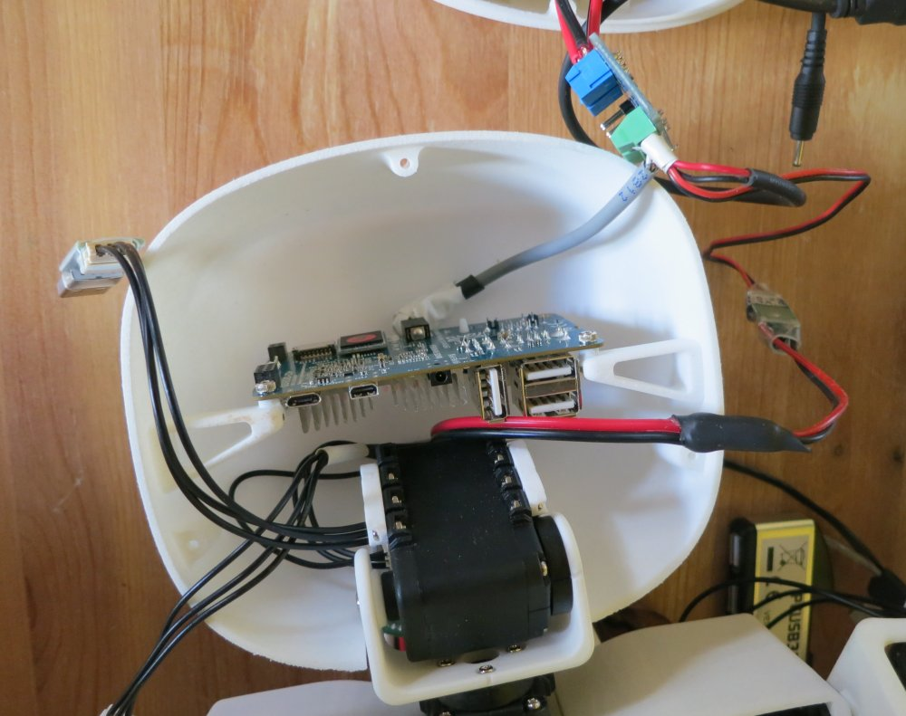
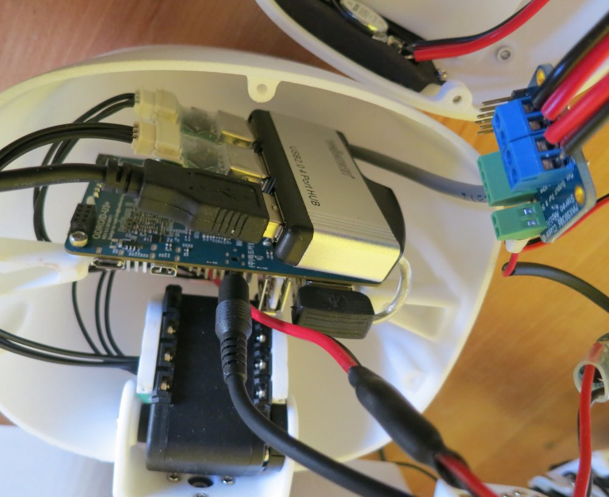

## Head {#head-assembly}

\

\

| Sub-assembly name |  Motor name |   Type  | ID |
|-------------------|:-----------:|:-------:|:--:|
| Head              |   head\_y   | AX-12A  | 37 |

### Setup of the Odroid board

The Odroid is normally shipped with a eMMC module with Ubuntu 1.14
already flashed (it should have a red sticker on it). Simply plug it on
the Odroid board and power it. After boot time, it should have the red
light steady and the blue light flashing.

If you don’t have a pre-flashed eMMC module, follow these instructions:
<https://github.com/poppy-project/poppy_install>

Connect the Odroid board to your network using an ethernet cable. You
have to access a wired network for initial setup (I tried link-local
without success).

Windows users may wish to install the
[Bonjour](https://support.apple.com/kb/DL999?locale=fr_FR&viewlocale=fr_FR)
software (the link is for the printer version, which does very well what
we want it to do). Bonjour is installed by default on Linux and Mac. It
is used to communicate with another device using its name instead of its
IP.

You should get an answer if you type:

    ping odroid.local

Windows users now probably wish to install
[Putty](http://www.putty.org/) or any SSH client. Linux and Mac users
have one installed by default. Then:

    ssh odroid@odroid.local

Password is odroid. Congratulations, you are now inside the Odroid!

Make sure the Odroid board has access to the internet and enter:

    curl -L https://raw.githubusercontent.com/poppy-project/
    poppy_install/master/poppy_setup.sh | sudo bash

Enter the odroid password. This command will download and run a script
which will download and prepare installation. The board asks for a
reboot:

    sudo reboot

You loose the SSH connection. The board has changed hostname and
password, so wait for the blue light to flash regularly and connect
with:

    ssh poppy@poppy.local

As you guessed, password is poppy. Installation process takes place
automatically (and takes a while). When you see ’System install
complete’, do a Ctrl+C to finish. After a new reboot, your Odroid board
is ready.

### Neck assembly

The last servomotor is head\_y, a AX-12A. Set its ID to 37 and response
time to 0 (baudrate is already at 1000000).

Screw the neck to head\_z servo (M2x8mm screws). There are marks on the
neck and on the servo to help you determine the orientation.

Put 2 nuts in the servo case and attach it in the head\_back part.

\

Assemble the servo on the neck (2 screws on the controlled side, the big
screw on the other side). You again have marks on the neck and on the
servo for orientation.

Connect head\_y to the dispatcher by passing the cable through the hole
in the head.

Plug a 500mm cable from the pelvis SMPS2Dynamixel board to the back of
the head. Attach a USB2AX at the end of this cable in the head.

Use a 140mm cable to connect the head\_y motor to another USB2AX.

### Camera and screen

Attach the camera support to head\_front using M2.5x4mm screws. Put tape
on the screws to avoid electrical interferences with the camera board.

Attach the camera to its support using 3 M2x6mm screws.

Put the screen and screen cover in the head. Attach the manga screen (or
the fake one) with 2 M2.5x6mm screws.

 

### Electronics

If you don’t have pre-soldered components, see:
<https://github.com/poppy-project/Poppy-minimal-head-design/blob/master/doc/poppy_soldering.md>

Pass the Dynamixel connector of the Ubec through the hole in the head
and connect it to the torso SMPS2Dynamixel.

Attach both the other side of Ubec and the Odroid power cable to the
audio amplifier. Be sure no to allow any short-circuit.

Plug the audio jack. Wires order from left to right (when power terminal
is farthest right): red-black-uncolored-white

Put 2 nuts around the flowers openings then attach the speakers using M2
x3mm screws.

Connect the speakers to audio ampli, left speaker black wire on Lout,
Right ampli black wire on Rout.

Plug audio jack in Odroid, then use 2 M2.5x8mm screws to attach the
Odroid board. Make sure the Ethernet connector is correctly placed in
front of the corresponding hole.

Plug the power jack. On the hub, plug the camera and the two USB2AXs.
Plug the wifi dongle and the Razor board if you have them. Push the hub
above the Odroid.

Then close the head using 3 M2x8mm screws.
